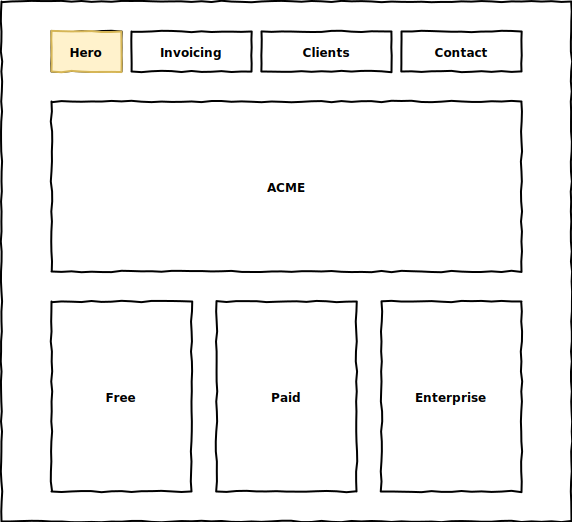
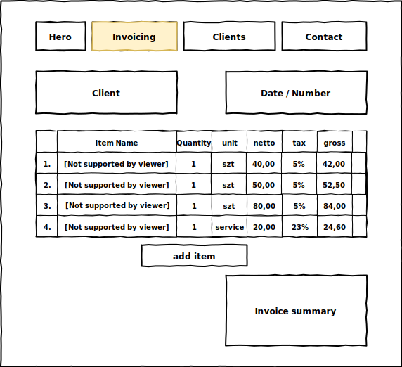

# Wsei Invoicing App Reference

Projekt referencyjny w ramach przedmiotu ``Projektowanie Aplikacji Webowych`` Wysza szkoła ekonomii i informatyki w Krakowie

# Mockup
## hero page

## invoicing page

# branch
* ex1 - utworzenie formularza, dynamiczna lista pozycji
* ex2 - routing hero / komunikacja dwustrona z komponentem
* ex3 - Komunikacja z API 
